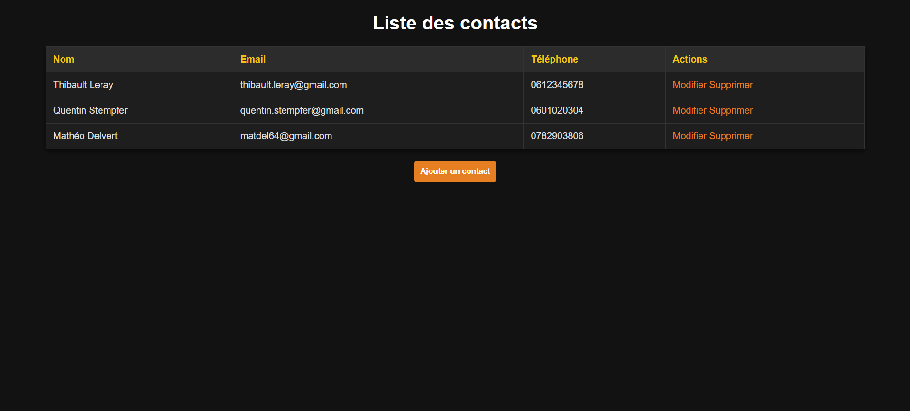

# Gestion des Contacts - PHP Project

## Description
Ce projet est une application web simple permettant de gérer une liste de contacts avec les fonctionnalités suivantes :
- Ajouter un contact.
- Modifier un contact.
- Supprimer un contact.
- Lister tous les contacts dans un tableau interactif.

## Prérequis
- Serveur **WAMP** ou **XAMPP** avec PHP et MySQL.
- Accès à **phpMyAdmin** pour gérer la base de données.

## Installation

### 1. Configuration de la Base de Données

1. **Connectez-vous à phpMyAdmin** :
   - Ouvrez un navigateur et allez à `http://localhost/phpmyadmin`.
   - Connectez-vous avec vos identifiants (par défaut : utilisateur `root`, mot de passe vide).

2. **Créer la base de données** :
   - Cliquez sur **Nouvelle base de données**.
   - Donnez le nom `contacts_db` à votre base de données et cliquez sur **Créer**.

3. **Créer la table** :
   - Sélectionnez la base de données `contacts_db` dans la barre latérale.
   - Allez dans l'onglet **SQL** et exécutez la requête suivante :
     ```sql
     CREATE TABLE IF NOT EXISTS contacts_db (
         id INT AUTO_INCREMENT PRIMARY KEY,
         fullName VARCHAR(100) NOT NULL,
         email VARCHAR(100) NOT NULL,
         phone VARCHAR(15) NOT NULL
     );
     ```

### 2. Installation des Fichiers du Projet

1. Téléchargez ou clonez ce projet dans le dossier **www** (WAMP) ou **htdocs** (XAMPP) :
   - Par exemple : `C:\wamp64\www\TP2`.

2. Assurez-vous que la structure des fichiers est comme suit :
   ```
   TP2/
   ├── add_contact.php
   ├── add_form.php
   ├── db.php
   ├── delete_contact.php
   ├── edit_contact.php
   ├── edit_form.php
   ├── functions.php
   ├── images/
   ├── index.php
   ├── style.css
   ```

3. Ouvrez le fichier `db.php` et configurez les paramètres de connexion à la base de données :
   ```php
   $dsn = 'mysql:host=localhost;dbname=contacts_db;charset=utf8mb4';
   $username = 'root';
   $password = '';
   ```

### 3. Lancer l'Application

1. Ouvrez votre navigateur et allez à l'URL suivante :
   ```
   http://localhost/TP2/index.php
   ```
2. Vous devriez voir une interface permettant de gérer vos contacts.

### 4. Ajouter un Contact

1. Cliquez sur le bouton **Ajouter un contact**.
2. Remplissez les champs (nom, email, téléphone) et cliquez sur **Ajouter**.
3. Le contact devrait apparaître dans le tableau principal.

### 5. Modifier ou Supprimer un Contact

- **Modifier** : Cliquez sur le lien **Modifier** à côté du contact et mettez à jour les informations.
- **Supprimer** : Cliquez sur le lien **Supprimer** pour retirer le contact de la base de données.

## Design

Le projet utilise un thème sombre avec des styles définis dans `style.css`. Si vous souhaitez personnaliser l'apparence, modifiez ce fichier.

## Structure des Fichiers

- `add_contact.php` : Traite les données envoyées depuis `add_form.php` et les insère dans la base de données.
- `add_form.php` : Formulaire HTML pour ajouter un contact.
- `db.php` : Gestion de la connexion à la base de données MySQL.
- `delete_contact.php` : Supprime un contact de la base de données.
- `edit_contact.php` : Traite la mise à jour des informations d'un contact.
- `edit_form.php` : Formulaire HTML pré-rempli pour modifier un contact.
- `functions.php` : Contient des fonctions réutilisables pour gérer les contacts.
- `index.php` : Affiche la liste des contacts avec les actions disponibles.
- `style.css` : Feuille de style pour le thème sombre.
- `images/` : Contient les ressources graphiques éventuelles.

## Captures d'Écran



## Auteurs
Développé par Mathéo Delvert.